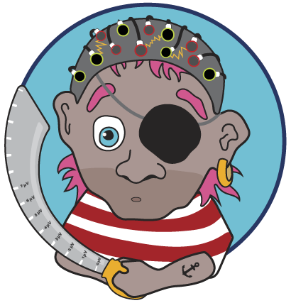

# pyreite :skull_and_crossbones:
 

### Pythonic, Yet Robust, Electrical Impedance Tomography (EIT) Expert

**A rowdy little EIT toolkit for plundering head tissue conductivities**

[](https://github.com/harmening/pyreite/actions)
[](https://codecov.io/gh/harmening/pyreite)
[](https://www.python.org/downloads/release/python-360/)

Knowing subject-specific head tissue conductivities in MEG / EEG (M/EEG) **significantly improves M/EEG source localization accuracy**.<br>
`pyreite` makes it cheap: a 60-second EIT measurement before your EEG session, no hardware changes beyond the stim box, and out come per-subject conductivities for scalp, skull, CSF, and cortex.
<br>
<br>


## Hoist the sails :sailboat:
### Prerequisites
- [Python3](https://www.python.org/downloads/) (>=3.7)
- [OpenMEEG](https://github.com/openmeeg/openmeeg/blob/master/README.rst#build-openmeeg-from-source) (2.4.7) with python wrapper (compiled with `"-DENABLE_PYTHON=ON"`)

### Install pyreite
```bash
git clone https://github.com/harmening/pyreite.git
cd pyreite
pip install .
```


### docker :whale:
Build pyreite image
```bash
$ docker build -t pyreite .
```
or pull from [docker hub](https://hub.docker.com/r/harmening/pyreite)
```bash
$ docker pull harmening/pyreite:v1.3
```


## Forward problem: simulate the voltages
```python
from os.path import join as pth
from collections import OrderedDict
from pyreite.OpenMEEGHead import OpenMEEGHead
from pyreite.data_io import load_tri, load_elecs_dips_txt


# Load Colins surface meshes
geom = OrderedDict()
for tissue in ['cortex', 'csf', 'skull', 'scalp']:
    geom[tissue] = load_tri(pth('tests', 'test_data', tissue+'.tri'))

# Define conductivity values [S/m]
cond = {'cortex': 0.201, 'csf': 1.65, 'skull': 0.01, 'scalp': 0.465}

# Load electrode positions
sens = load_elecs_dips_txt(pth('tests', 'test_data', 'electrodes_aligned.txt'))


# Create EIT head model
model = OpenMEEGHead(cond, geom, sens)

# Calculate EIT voltage measurement array
V = model.V
```
<br>


## Inverse problem: recover the conductivities

The forward problem above takes conductivities and gives you voltages. The reverse — given measured voltages, find the conductivities — is what `pyreite` is actually for.

Given the electrode voltages **V_exp** measured during EIT, recover the
tissue conductivities **σ = (σ_brain, σ_skull, σ_scalp)** by minimizing
the data misfit between simulation and experiment.

### Forward map

The EIT head model returns the simulated electrode voltages as

$$ V(\sigma) = h_{2em} A(\sigma)^{-1} b(\sigma), $$

where $A(\sigma)$ is the symmetric BEM system matrix, $b$ the EIT
source matrix (`eitsm`), and $h_{2em}$ the head-to-electrode operator.

### Inverse problem

Recovery minimizes the residual loss

$$ \Phi(\sigma) = \tfrac{1}{2}\lVert V_{\text{exp}} - V(\sigma)\rVert^{2}. $$

`pyreite` uses Levenberg–Marquardt with Tikhonov regularization. The
first-order step

$$ \delta\sigma_1 = \bigl(J^{\!\top} J + \lambda^{2} L\bigr)^{-1}
   J^{\!\top} r, \qquad
   r = V_{\text{exp}} - V(\sigma),\ \ J = \partial V/\partial\sigma $$

is augmented with a Hessian-acceleration correction

$$ \delta\sigma_2 = \tfrac{1}{2}\bigl(J^{\!\top} J + \lambda^{2} L\bigr)^{-1}
   J^{\!\top}\bigl(\delta\sigma_1^{\!\top} H \delta\sigma_1\bigr), $$

where $H = \partial^{2} V/\partial\sigma^{2}$ is the per-measurement
Hessian. Iteration: $\sigma_{k+1} = \sigma_k - (\delta\sigma_1 + \delta\sigma_2)$.

The Jacobian $J$ and Hessian $H$ are derived analytically from the BEM
system matrix in `pyreite/material_derivative.py` — no autodiff or finite
differences in the inner loop.

### Code
> **Heads up on runtime.** A full LM optimization on the bundled Colin27 meshes takes **~10–20 minutes** on a laptop, dominated by the dense BEM matrix inversion. For quick smoke tests on tiny synthetic icospheres, see the `tests/` suite.
<br>

```python
import numpy as np
from collections import OrderedDict
from os.path import join as pth

from pyreite.OpenMEEGHead import OpenMEEGHead
from pyreite.data_io import load_tri, load_elecs_dips_txt
from pyreite.EIThelpers import EIT_protocol
from pyreite.optimizers import (
    loss_residuals, jac_hess, levenberg_marquardt_hessiancheck,
)

# Load 3-shell Colin27 head (brain / skull / scalp) + aligned electrodes.
# We use the bundled csf.tri as the inner "brain" boundary.
geom = OrderedDict()
geom['brain'] = load_tri(pth('tests', 'test_data', 'csf.tri'))
geom['skull'] = load_tri(pth('tests', 'test_data', 'skull.tri'))
geom['scalp'] = load_tri(pth('tests', 'test_data', 'scalp.tri'))
sens = load_elecs_dips_txt(pth('tests', 'test_data', 'electrodes_aligned.txt'))
ND2V = EIT_protocol(num_elec=len(sens), n_freq=1, protocol='all_realistic')

# Simulate the experiment with the "true" subject-specific conductivities [S/m]
exp_cond = {'brain': 0.40, 'skull': 0.01, 'scalp': 0.45}
V_exp = OpenMEEGHead(exp_cond, geom, sens).V.flatten()[ND2V]

# Start the inverse from a different guess and iterate
cond  = OrderedDict([('brain', 0.30), ('skull', 0.013), ('scalp', 0.30)])
model = OpenMEEGHead(cond, geom, sens)
Lpr0  = np.identity(len(cond))                       # no prior weighting

for step in range(20):
    dV   = loss_residuals(cond, model, V_exp, ND2V=ND2V)   # residual r
    J, H = jac_hess(cond, model, V_exp, ND2V=ND2V)         # analytic ∂V/∂σ, ∂²V/∂σ²
    delta = levenberg_marquardt_hessiancheck(J, H, dV, lamb=0.0, Lpr0=Lpr0)
    cond  = OrderedDict((t, s - d) for (t, s), d in zip(cond.items(), delta))
    if 0.5 * np.nansum(dV**2) < 1e-7:
        break

print('Recovered conductivity:', {t: round(s, 4) for t, s in cond.items()})
# -> Recovered conductivity: {'brain': 0.4, 'skull': 0.01, 'scalp': 0.45}
#    (matches exp_cond after ~4 LM iterations)
```

The full driver — adaptive damping, fixed-tissue handling, convergence
diagnostics — lives in `examples/cond_colin.py`:

```bash
python examples/cond_colin.py
```
... or with docker:
```bash
docker run -t harmening/pyreite:v1.3 python /examples/cond_colin.py
```
<br>


